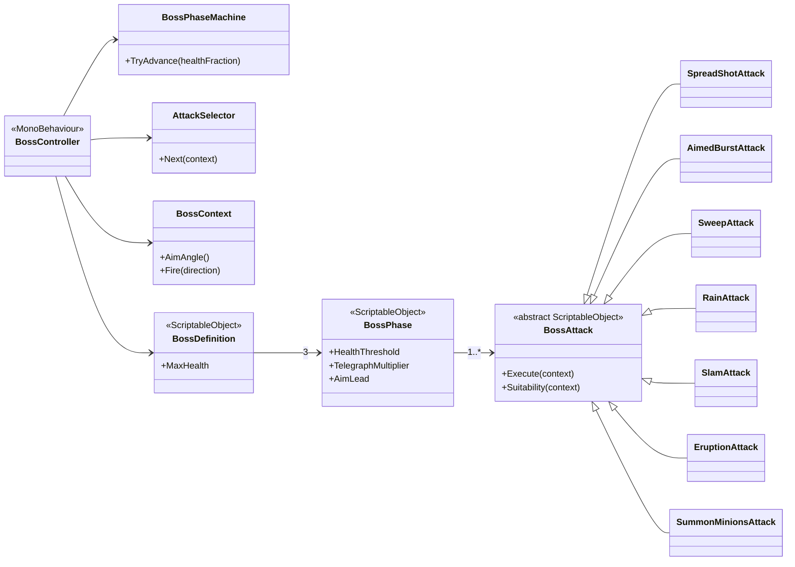
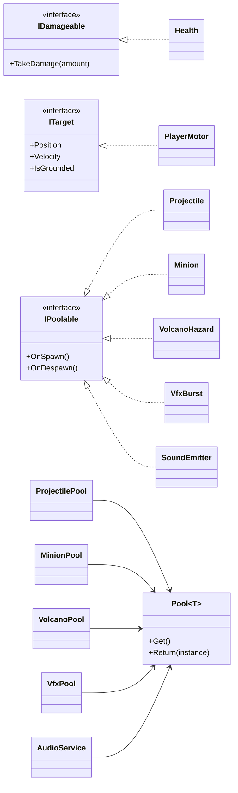

# Crazy Diamond

A single-screen boss fight in the style of *Cuphead*'s ground battles, built in
Unity 6 with the Universal Render Pipeline.

Final assignment for the Advanced Unity course.
**Author:** Itai Muntner

---

## Links

| | |
|---|---|
| ▶ **Play in your browser** | [Crazy Diamond on itch.io](https://itaimuntner.itch.io/crazy-diamond) |
| 🎬 **Gameplay video** | [Watch the fight](https://www.youtube.com/watch?v=Bg_HPXVisnk) |
| 🧭 **Code review video** | [Walkthrough of the architecture](https://www.youtube.com/watch?v=msbyML4nfTM) |

---

## The fight

A fixed, single-screen arena. The player starts on the left, the boss is anchored
on the right, and the fight runs until one of them reaches zero health.

### Controls

| Action | Key |
|---|---|
| Move | **A / D** or **Left / Right Arrows** |
| Jump (and double jump) | **W** or **Up Arrow** |
| Dash | **Left Shift** |
| Shoot | **Left Mouse** or **Space** |
| Pause | **P** or **Escape** |

The dash is short, cannot be steered once started, grants invulnerability for its
duration, and is limited to one per trip through the air.

> Playing in the browser: click the game once before using the keyboard. WebGL
> only receives key presses while its canvas has focus.

### Attacks

| Attack | What it does |
|---|---|
| Spread shot | A fan of projectiles, aimed at the player |
| Aimed burst | A short burst, re-aimed between each shot |
| Sweep | A stream of shots rotating across an arc |
| Rain | Projectiles falling from above, scattered around the player |
| Slam | Shockwaves travelling along the floor |
| Eruption | Vents that open on the ground and erupt upwards after a warning |
| Summon | Minions that pursue the player and burst on contact |

### Boss behaviour

- Three phases, entered at 100%, 66% and 33% of the boss's health.
- Each phase defines its own attack list, cooldown range, telegraph and recovery
  multipliers, aim lead, and sprite tint.
- Every attack plays a telegraph — its own colour, motion and sound — before it
  lands. The phase change uses a visibly different one.
- Shots are aimed at a predicted intercept point rather than the player's current
  position. How far the boss leads is set per phase.
- Each attack scores its suitability for the current situation. The selector
  draws two candidates and uses the higher-scoring one.
- Attack order comes from a shuffle bag, so no attack follows itself.
- A phase change pauses the boss and makes it invulnerable, but does not clear
  what is already in the arena.

---

## Architecture

### The boss



`BossController` sequences telegraph, active, recovery and cooldown. An attack
supplies the active beat; the phase supplies the multipliers.

### Shared foundations



`Pool<T>` is a plain C# class rather than a component, so each concrete pool is a
small non-generic `MonoBehaviour` that owns one.

### Notes

- Attacks, phases, the boss, sounds and the scene catalog are ScriptableObject
  assets.
- `SceneLoader` and `AudioService` are the only persistent singletons.
- UI observes C# events on `Health`, `BossPhaseMachine` and `GameStateMachine`.
  Gameplay code contains no reference to a UI type.
- 47 EditMode tests across five suites: health, pooling, attack selection, phase
  thresholds and attack suitability.

---

## Project structure

```
Assets/_Project/
├── Scenes/          Bootstrap · MainMenu · BossLevel
├── Scripts/
│   ├── App/         GameBootstrap, SceneLoader, SceneCatalog, GameStateMachine
│   ├── Audio/       AudioService, SoundEvent, SoundEmitter, LoopingSound
│   ├── Boss/        BossController, BossPhaseMachine, AttackSelector, BossContext
│   │   ├── Attacks/ BossAttack and the seven concrete attacks
│   │   └── Data/    BossDefinition, BossPhase
│   ├── Combat/      Health, Projectile, Minion, VolcanoHazard and their pools
│   ├── Feel/        SpriteEffects, DamageFeedback, HitStop, CameraShake, VFX
│   ├── UI/          Health bars, phase banner, end screen, pause menu
│   ├── Common/      Pool, IPoolable, PersistentSingleton
│   └── Editor/      WebGlBuildTool
├── Data/            ScriptableObject assets
├── Shaders/         SpriteEffects.shader
├── Prefabs/  Art/  Settings/
└── Tests/           EditMode tests and their support assembly
```

---

## Running it

Open the project in **Unity 6000.0.41f1** and play from
`Assets/_Project/Scenes/Bootstrap.unity`.

`BossLevel.unity` can also be played directly; the retry button falls back to
reloading in place when the persistent services do not exist.

**Tests:** Window ▸ General ▸ Test Runner ▸ EditMode ▸ Run All.

**Web build:** Boss Level ▸ Build WebGL. Applies the player settings, checks that
`Bootstrap` is the first scene, and writes the output to `docs/`.

---

## Built with

Unity 6000.0.41f1 · URP 17.0.4 (2D Renderer) · Input System 1.13.1 ·
DOTween · Unity Test Framework
