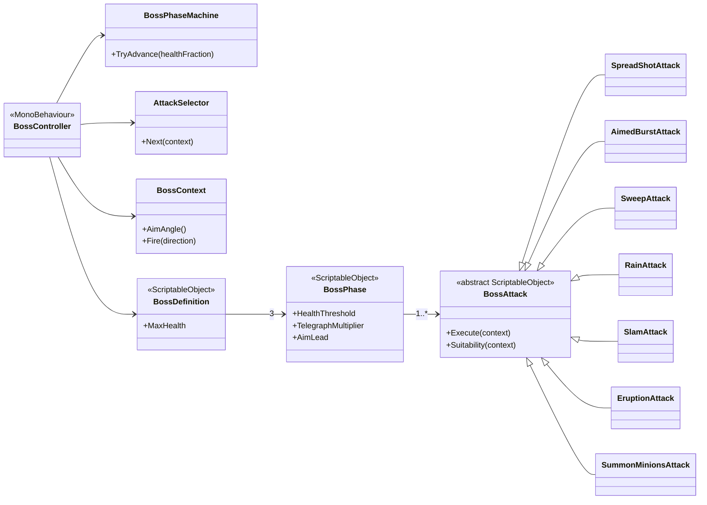
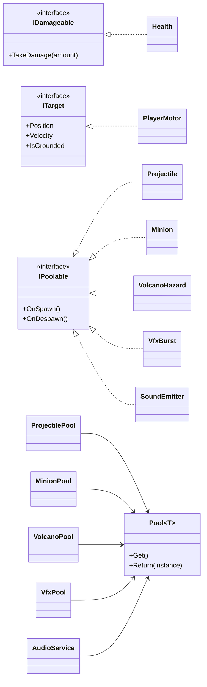

# Crazy Diamond — Cuphead-Style Boss Fight

[-blue)](https://docs.unity3d.com/Packages/com.unity.render-pipelines.universal@17.0/manual/index.html)

> Developed as the final assignment for an **Advanced Unity** course.  
> A single-screen boss fight built around data-driven attacks, a boss that predicts and chooses, and pooled combat systems.

---

## Links

| | |
|---|---|
| ▶ **Play in your browser** | [Crazy Diamond on itch.io](https://itaimuntner.itch.io/crazy-diamond) |
| 🎬 **Gameplay video** | [Watch the fight](https://www.youtube.com/watch?v=Bg_HPXVisnk) |
| 🧭 **Code review video** | [Walkthrough of the architecture](https://www.youtube.com/watch?v=msbyML4nfTM) |

---

## 📋 Table of Contents
1. [🧠 Features](#-features)
2. [🎮 Controls](#-controls)
3. [🔧 Architecture Overview](#-architecture-overview)
4. [📈 UML Diagrams](#-uml-diagrams)
5. [📦 Assets & Credits](#-assets--credits)

---

## 🧠 Features

- ⚔️ **Player kit** — run, double jump, dash with invulnerability frames, rate-limited fire
- 🧠 **Boss AI** — three phases, seven attacks, predictive aiming, situational attack choice
- 📦 **Data-driven content** — attacks, phases, the boss and every sound are ScriptableObject assets
- ♻️ **One generic pool** — reused by projectiles, minions, volcanic vents, particles and audio
- 🎨 **Custom URP shader** — hit flash, telegraph tint, phase tint and death dissolve in one pass
- 💥 **Hit feedback** — hit stop, camera shake, particle bursts, tweened UI
- 🔊 **Audio system** — pooled one-shots, crossfading music, looping sustained fire
- ⏸️ **Pause, win and lose** — full game state flow with async scene loading
- 🧪 **47 EditMode tests** across health, pooling, attack selection, phases and AI judgement
- 🌐 **WebGL build** produced by an in-editor build tool

### Attacks

| Attack | What it does |
|---|---|
| Spread shot | A fan of projectiles, aimed at the player |
| Aimed burst | A short burst, re-aimed between each shot |
| Sweep | A stream of shots rotating across an arc |
| Rain | Projectiles falling from above, scattered around the player |
| Slam | Shockwaves travelling along the floor |
| Eruption | Vents that open on the ground and erupt upwards after a warning |
| Summon | Minions that pursue the player and burst on contact |

Every attack plays its own telegraph — colour, motion and sound — before it
lands. Shots are aimed at a predicted intercept point rather than the player's
current position, and how far the boss leads is set per phase.

---

## 🎮 Controls

| Action | Keyboard | Description |
|---|---|---|
| Move | A / D or ← → | Walk left / right |
| Jump | W or ↑ | Jump, and one extra jump in the air |
| Dash | Left Shift | Short, unsteerable, passes through damage |
| Shoot | Left Mouse or Space | Rate-limited while held |
| Pause | P or Escape | Freezes the fight; continue, restart, quit |

> Playing in the browser: click the game once before using the keyboard. WebGL
> only receives key presses while its canvas has focus.

---

## 🔧 Architecture Overview

| System | File | Description |
|---|---|---|
| **Boss loop** | `BossController.cs` | Sequences telegraph, strike, recovery and cooldown |
| **Phases** | `BossPhaseMachine.cs` | Health thresholds; advances one phase at a time |
| **Attack choice** | `AttackSelector.cs` | Shuffle bag, weighted by each attack's suitability |
| **Attack data** | `BossAttack.cs` + 7 assets | ScriptableObject attacks, each supplying its own coroutine |
| **Boss data** | `BossDefinition.cs`, `BossPhase.cs` | Health, thresholds, multipliers, aim lead, tint |
| **World view** | `BossContext.cs` | What an attack knows: aim, prediction, footing, line of sight |
| **Player** | `PlayerMotor.cs`, `PlayerInputReader.cs`, `PlayerShooter.cs` | Movement, single input source, rate-limited fire |
| **Health** | `Health.cs` | Shared by player, boss and minions; counted invulnerability |
| **Pooling** | `Pool.cs` + five concrete pools | Projectiles, minions, vents, particles, audio |
| **Scene flow** | `SceneLoader.cs`, `GameStateMachine.cs` | Async loading; Intro → Fighting → Won / Lost |
| **Audio** | `AudioService.cs`, `SoundEvent.cs` | Pooled one-shots, crossfading music, sounds as assets |
| **Feel** | `SpriteEffects.cs`, `HitStop.cs`, `CameraShake.cs` | Shader-driven flash and dissolve, freeze, shake |
| **UI** | `PauseMenu.cs`, `EndScreen.cs`, `BossHealthBar.cs` | Pause, endings, health bars, phase banner |
| **Build** | `WebGlBuildTool.cs` | Validates and produces the WebGL build |

UI observes C# events on `Health`, `BossPhaseMachine` and `GameStateMachine`;
gameplay code contains no reference to a UI type.

---

## 📈 UML Diagrams

### The boss

### Shared foundations

`Pool<T>` is a plain C# class rather than a component, so each concrete pool is a
small non-generic `MonoBehaviour` that owns one.

---

## 📦 Assets & Credits

| Type | Source |
|---|---|
| Tweening | [DOTween](http://dotween.demigiant.com/) by Demigiant |
| Engine | Unity 6 (URP 2D Renderer) |
| Inspiration | 🎮 *Cuphead* by Studio MDHR |

> All third-party content is used for non-commercial, educational purposes.

---

## Running it

Open the project in **Unity 6000.0.41f1** and play from
`Assets/_Project/Scenes/Bootstrap.unity`.

**Tests:** Window ▸ General ▸ Test Runner ▸ EditMode ▸ Run All.

**Web build:** Boss Level ▸ Build WebGL. Applies the player settings, checks that
`Bootstrap` is the first scene, and writes the output to `docs/`.
